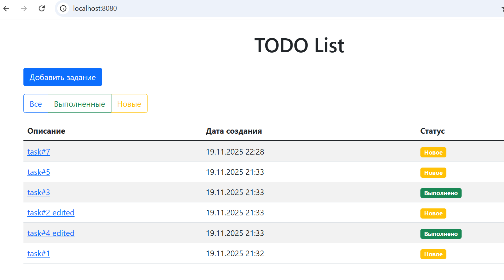
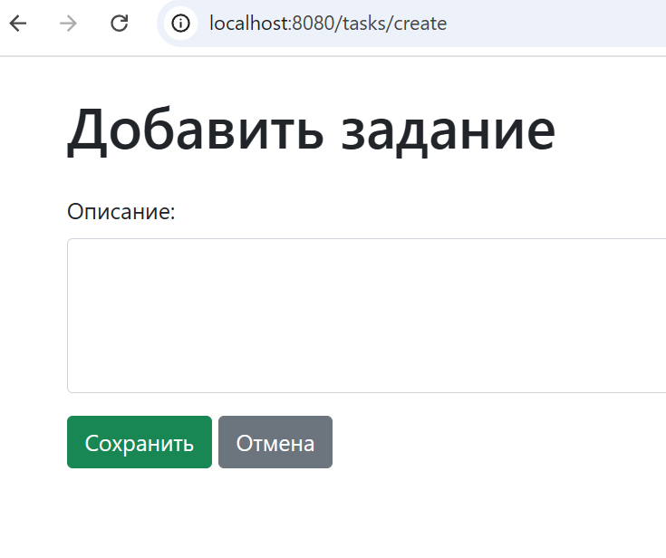
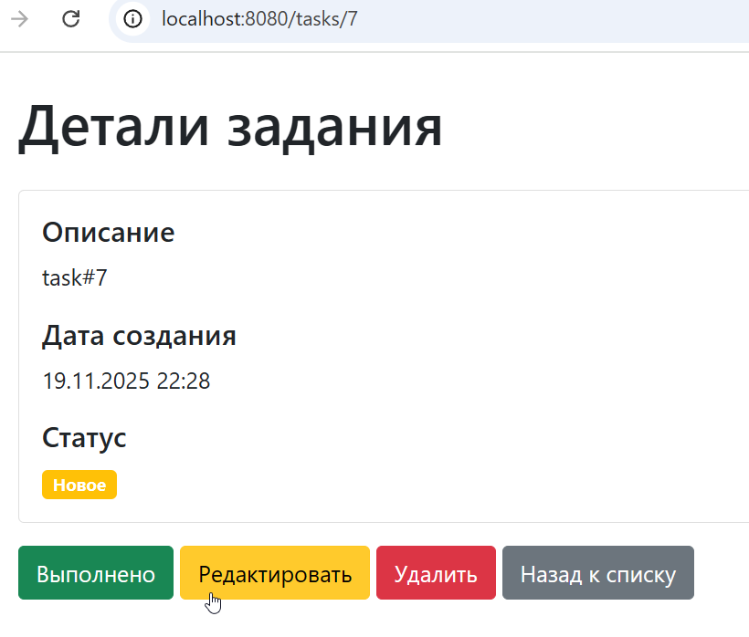
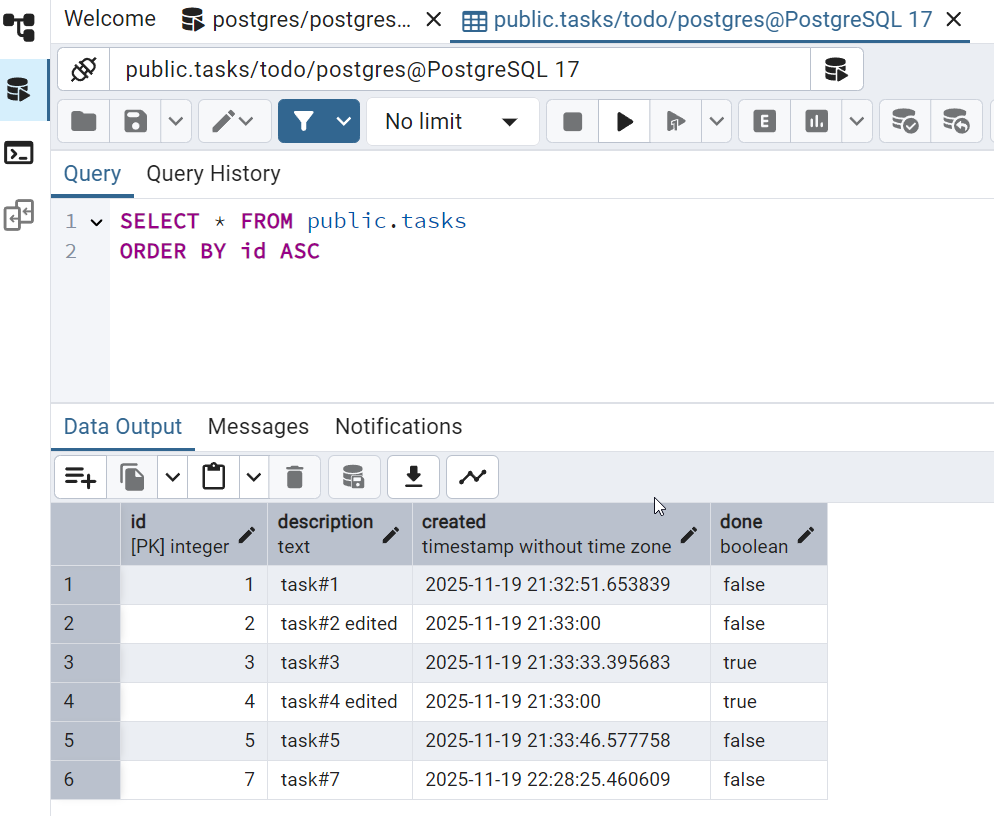

# job4j_todo

## Приложение "Список запланированных дел, которые нужно сделать".

<b>Стек технологий</b>

1. Spring Boot 2.7.3;
2. Thymeleaf 3.0.15 stable;
3. Hibernate 5.6.11.Final;
4. PostgreSQL JDBC driver 42.2.9;
5. Bootstrap 5.1.3;
6. H2database 2.1.214;
7. Lombok 1.18.30.

Краткое описание проекта:
---------------------------------------
To-Do List на Spring Boot — это веб-приложение для управления задачами (список дел) с использованием современной Java-экосистемы.
Приложение реализует классическую архитектуру MVC с разделением на слои:

- Model — сущность Task (JPA/Hibernate),
- Repository — TaskStore (управление БД через Hibernate Session),
- Service — TaskService (бизнес-логика),
- Controller — MainController и TaskController (обработка HTTP-запросов),
- View — HTML-шаблоны с Thymeleaf и стилизацией на Bootstrap 5.

<b>Функциональность:</b>

- Создание, просмотр, редактирование и удаление задач.
- Фильтрация: Все, Новые, Выполненные.
- Отображение даты создания в формате dd.MM.yyyy HH:mm.
- Управление статусом задачи (выполнено/не выполнено).

Для управления схемой базы данных используется Liquibase, а для тестирования — H2 в памяти.
В продакшене приложение работает с PostgreSQL.

Представления(View):
---------------------------------------
- Страница со списком всех заданий. В таблице отображаем имя, дату создания и состояние (выполнено или нет)
- На странице со списком добавить кнопку "Добавить задание".
- На странице со списком добавьте три ссылки: "Все", "Выполненные", "Новые". При переходе по ссылкам в таблице нужно отображать: все задания, только выполненные или только новые.
- При клике на задание переходим на страницу с подробным описанием задания.
- На странице с подробным описанием добавить кнопки: "Выполнено", "Редактировать", "Удалить".
- Если нажали на кнопку выполнить, то задание переводится в состояние выполнено.
- Кнопка "Редактировать" переводит пользователя на отдельную страницу для редактирования.
- Кнопка "Удалить" удаляет задание и переходит на список всех заданий.

Требования к окружению:
---------------------------------------

- Java JDK 11+ Рекомендуется JDK 17 или 21 (LTS)
- Maven 3.8+ Для сборки проекта
- PostgreSQL 12+ Для продакшена (опционально для тестов не нужен)
- Liquibase 4.20+ Встроен в Spring Boot, не требует отдельной установки
- Браузер Любой современный (Chrome, Firefox, Edge) Для интерфейса

Для разработки и тестирования PostgreSQL не обязателен — используется встроенная H2-база.

Как запустить проект:
---------------------------------------
- Шаг 1: Клонируйте репозиторий
- Шаг 2: Убедитесь, что Java и Maven установлены
- Шаг 3: Установите и запустите PostgreSQL
- Шаг 4: Запустите приложение

                 mvn spring-boot:run 
- Шаг 5: Откройте браузер

  Перейдите по адресу:
  http://localhost:8080
  
  Вы увидите интерфейс To-Do List с кнопками:
  - Добавить задание — создаёт новую задачу.

  - Все / Новые / Выполненные — фильтры.

  - Ссылки на задачи — открывают детали.

  - Выполнить / Удалить / Редактировать — действия через формы.

Ваше приложение запущено, работает с базой данных, и вы можете добавлять, редактировать и отслеживать задачи через удобный веб-интерфейс.

<b>Скриншоты запущенного приложения:</b>

